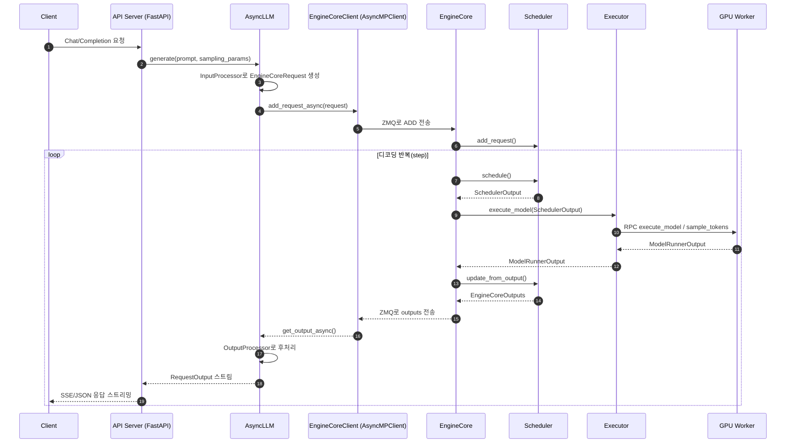
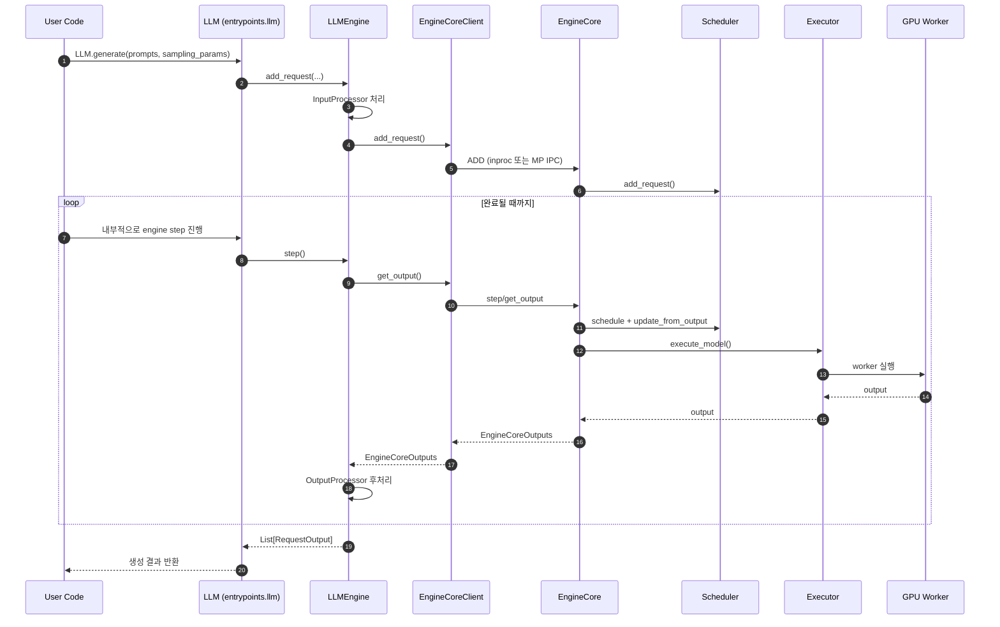

# vLLM 코드 구조 개요 (한국어)

이 문서는 vLLM 저장소의 코드 구조를 "실행 경로 중심"으로 빠르게 파악하기 위한 안내서입니다.  
기능별 상세 설계는 기존 문서(예: `arch_overview.md`)를 참고하고, 여기서는 실제 코드 탐색 순서를 중심으로 정리합니다.

[TOC]

## 범위와 전제

- 기준 코드: 현재 `main` 브랜치의 vLLM V1 구조
- 핵심 포인트:
  - `vllm/engine/llm_engine.py`와 `vllm/engine/async_llm_engine.py`는 실제 구현이 아니라 V1 구현을 가리키는 alias입니다.
  - 실질 구현은 `vllm/v1/` 하위에 있습니다.

관련 파일:

- [vllm/engine/llm_engine.py](../../vllm/engine/llm_engine.py)
- [vllm/engine/async_llm_engine.py](../../vllm/engine/async_llm_engine.py)
- [vllm/v1/engine/llm_engine.py](../../vllm/v1/engine/llm_engine.py)
- [vllm/v1/engine/async_llm.py](../../vllm/v1/engine/async_llm.py)

## 최상위 디렉터리 지도

아래는 `vllm/` 패키지에서 구조 이해에 가장 중요한 디렉터리들입니다.

| 디렉터리 | 역할 | 먼저 볼 파일 |
|---|---|---|
| `vllm/entrypoints` | 사용자 진입점(CLI, Python API, OpenAI 서버) | [vllm/entrypoints/cli/main.py](../../vllm/entrypoints/cli/main.py), [vllm/entrypoints/cli/serve.py](../../vllm/entrypoints/cli/serve.py), [vllm/entrypoints/llm.py](../../vllm/entrypoints/llm.py), [vllm/entrypoints/openai/api_server.py](../../vllm/entrypoints/openai/api_server.py) |
| `vllm/engine` | 호환 레이어(엔진 alias) | [vllm/engine/llm_engine.py](../../vllm/engine/llm_engine.py), [vllm/engine/async_llm_engine.py](../../vllm/engine/async_llm_engine.py) |
| `vllm/v1/engine` | 엔진 프런트엔드/클라이언트/프로세스 제어 | [vllm/v1/engine/llm_engine.py](../../vllm/v1/engine/llm_engine.py), [vllm/v1/engine/async_llm.py](../../vllm/v1/engine/async_llm.py), [vllm/v1/engine/core_client.py](../../vllm/v1/engine/core_client.py), [vllm/v1/engine/core.py](../../vllm/v1/engine/core.py) |
| `vllm/v1/core` | 스케줄러, KV 캐시 관리, 요청 상태 관리 | [vllm/v1/core/sched/scheduler.py](../../vllm/v1/core/sched/scheduler.py) |
| `vllm/v1/executor` | 실행 백엔드 선택/분산 실행(RPC) | [vllm/v1/executor/abstract.py](../../vllm/v1/executor/abstract.py), [vllm/v1/executor/multiproc_executor.py](../../vllm/v1/executor/multiproc_executor.py), [vllm/v1/executor/uniproc_executor.py](../../vllm/v1/executor/uniproc_executor.py) |
| `vllm/v1/worker` | GPU 워커(디바이스 초기화, 모델 실행, 캐시 할당) | [vllm/v1/worker/gpu_worker.py](../../vllm/v1/worker/gpu_worker.py) |
| `vllm/model_executor` | 모델 로딩/레이어/모델 구현체 | [vllm/model_executor/model_loader/__init__.py](../../vllm/model_executor/model_loader/__init__.py), [vllm/model_executor/models/registry.py](../../vllm/model_executor/models/registry.py) |
| `vllm/config` | 전체 설정 모델(`VllmConfig` 및 하위 config들) | [vllm/config/vllm.py](../../vllm/config/vllm.py), [vllm/engine/arg_utils.py](../../vllm/engine/arg_utils.py) |
| `vllm/distributed` | TP/PP/DP, KV/EC transfer, 통신 유틸 | [vllm/distributed/parallel_state.py](../../vllm/distributed/parallel_state.py) |
| `vllm/plugins` | 엔트리포인트 기반 플러그인 로딩 | [vllm/plugins/__init__.py](../../vllm/plugins/__init__.py) |
| `csrc/` (repo root) | C++/CUDA 커스텀 커널 구현 | [csrc/torch_bindings.cpp](../../csrc/torch_bindings.cpp) |

## 실행 경로 1: Offline Python API (`LLM`)

`from vllm import LLM` 사용 시의 핵심 흐름:

1. [vllm/entrypoints/llm.py](../../vllm/entrypoints/llm.py)의 `LLM` 클래스 생성
2. 내부에서 `EngineArgs`를 조합해 `VllmConfig` 생성
3. [vllm/v1/engine/llm_engine.py](../../vllm/v1/engine/llm_engine.py)의 `LLMEngine` 생성
4. `LLM.generate()` 호출 시:
   - `InputProcessor`가 입력을 `EngineCoreRequest`로 변환
   - `EngineCoreClient`를 통해 코어 엔진으로 전달
   - 출력은 `OutputProcessor`가 `RequestOutput`으로 변환해 반환

핵심 파일:

- [vllm/entrypoints/llm.py](../../vllm/entrypoints/llm.py)
- [vllm/v1/engine/llm_engine.py](../../vllm/v1/engine/llm_engine.py)
- [vllm/v1/engine/input_processor.py](../../vllm/v1/engine/input_processor.py)
- [vllm/v1/engine/output_processor.py](../../vllm/v1/engine/output_processor.py)

## 실행 경로 2: Online Serving (`vllm serve`)

OpenAI 호환 서버 실행 시 흐름:

1. CLI 진입: [vllm/entrypoints/cli/main.py](../../vllm/entrypoints/cli/main.py)
2. `serve` 서브커맨드: [vllm/entrypoints/cli/serve.py](../../vllm/entrypoints/cli/serve.py)
3. 서버 앱/엔진 클라이언트 구성: [vllm/entrypoints/openai/api_server.py](../../vllm/entrypoints/openai/api_server.py)
4. `AsyncLLM` 기반으로 비동기 요청 처리:
   - 요청 수신(FastAPI)
   - `AsyncLLM.generate()` 호출
   - 백그라운드 output handler가 엔진 출력 수집/스트리밍

핵심 포인트:

- API 서버는 FastAPI 레이어이고, 실제 토큰 생성 루프는 `AsyncLLM + EngineCore`가 담당합니다.
- 멀티프로세스 모드에서 API 프로세스와 엔진 코어는 ZMQ로 통신합니다.

## 동작 시퀀스 다이어그램 (Mermaid)

### Online Serving (`vllm serve`)

### Offline Inference (`LLM.generate`)

## 엔진 내부 계층 (V1)

### 1) Frontend Engine (`LLMEngine` / `AsyncLLM`)

- 책임:
  - 입력 전처리
  - 요청 등록/취소
  - 출력 후처리
  - 로깅/메트릭 훅
- 파일:
  - [vllm/v1/engine/llm_engine.py](../../vllm/v1/engine/llm_engine.py)
  - [vllm/v1/engine/async_llm.py](../../vllm/v1/engine/async_llm.py)

### 2) EngineCoreClient (Frontend-Core 브리지)

- `InprocClient`, `SyncMPClient`, `AsyncMPClient`로 실행 모드 분기
- 모드에 따라 in-process 호출 또는 ZMQ 기반 IPC 수행
- 파일:
  - [vllm/v1/engine/core_client.py](../../vllm/v1/engine/core_client.py)

### 3) EngineCore (스케줄링 루프)

- 핵심 루프:
  - 요청 큐 처리
  - 스케줄링
  - 모델 실행 호출
  - 출력 집계/반환
- 파일:
  - [vllm/v1/engine/core.py](../../vllm/v1/engine/core.py)

### 4) Scheduler (요청/토큰 단위 계획)

- waiting/running 큐 관리
- KV 캐시 블록 할당/회수
- prefill/decode 스케줄 결정
- 파일:
  - [vllm/v1/core/sched/scheduler.py](../../vllm/v1/core/sched/scheduler.py)
  - [vllm/v1/core/sched/output.py](../../vllm/v1/core/sched/output.py)

### 5) Executor (분산 실행 추상화)

- `distributed_executor_backend` 설정에 따라 구현 선택:
  - `uni`: 단일 프로세스
  - `mp`: 멀티프로세스
  - `ray`: Ray 기반
- 파일:
  - [vllm/v1/executor/abstract.py](../../vllm/v1/executor/abstract.py)
  - [vllm/v1/executor/uniproc_executor.py](../../vllm/v1/executor/uniproc_executor.py)
  - [vllm/v1/executor/multiproc_executor.py](../../vllm/v1/executor/multiproc_executor.py)

### 6) Worker (GPU 실행 단위)

- 디바이스 초기화, 모델 로딩, KV 캐시 할당, forward/sample 수행
- `GPUModelRunner`를 통해 실제 모델 실행
- 파일:
  - [vllm/v1/worker/gpu_worker.py](../../vllm/v1/worker/gpu_worker.py)

## 설정 계층 (`EngineArgs` -> `VllmConfig`)

설정 생성의 중심:

- CLI/Python 인자 파싱: [vllm/engine/arg_utils.py](../../vllm/engine/arg_utils.py)
- 통합 설정 객체: [vllm/config/vllm.py](../../vllm/config/vllm.py)

핵심 구조:

- `EngineArgs` / `AsyncEngineArgs`가 개별 옵션을 수집
- `create_engine_config()`에서 `ModelConfig`, `CacheConfig`, `ParallelConfig` 등 하위 설정 조합
- 결과로 `VllmConfig` 하나를 엔진 계층 전반에 전달

이 설계 덕분에 하위 모듈(스케줄러/워커 등)이 필요한 설정을 공통 객체에서 읽을 수 있습니다.

## 모델 계층 (`model_executor`)

- 모델 선택/등록:
  - [vllm/model_executor/models/registry.py](../../vllm/model_executor/models/registry.py)
- 모델 구현체:
  - [vllm/model_executor/models/__init__.py](../../vllm/model_executor/models/__init__.py)
- 로더/가중치 처리:
  - [vllm/model_executor/model_loader/__init__.py](../../vllm/model_executor/model_loader/__init__.py)

특징:

- 매우 많은 HF 아키텍처를 registry로 매핑
- 공통 인터페이스를 유지해 엔진 레벨에서 모델별 분기 복잡도를 낮춤

## 커스텀 커널 계층 (`csrc`, `_custom_ops.py`)

- Python 래퍼:
  - [vllm/_custom_ops.py](../../vllm/_custom_ops.py)
- 실제 C++/CUDA 구현:
  - [csrc/torch_bindings.cpp](../../csrc/torch_bindings.cpp)

`torch.ops`를 통해 Python 레벨에서 커스텀 연산을 호출하며, 성능에 민감한 연산(예: attention 관련)을 이 계층이 담당합니다.

## 플러그인/확장 포인트

- 일반 플러그인 로딩:
  - [vllm/plugins/__init__.py](../../vllm/plugins/__init__.py)
- IO processor 플러그인:
  - [vllm/plugins/io_processors/__init__.py](../../vllm/plugins/io_processors/__init__.py)

엔트리포인트 그룹 기반으로 플러그인을 로딩하므로, 별도 패키지에서 기능 확장이 가능합니다.

## 코드 읽기 추천 순서

처음 기여할 때는 아래 순서를 권장합니다.

1. [vllm/entrypoints/cli/serve.py](../../vllm/entrypoints/cli/serve.py)
2. [vllm/entrypoints/openai/api_server.py](../../vllm/entrypoints/openai/api_server.py)
3. [vllm/v1/engine/async_llm.py](../../vllm/v1/engine/async_llm.py)
4. [vllm/v1/engine/core_client.py](../../vllm/v1/engine/core_client.py)
5. [vllm/v1/engine/core.py](../../vllm/v1/engine/core.py)
6. [vllm/v1/core/sched/scheduler.py](../../vllm/v1/core/sched/scheduler.py)
7. [vllm/v1/executor/abstract.py](../../vllm/v1/executor/abstract.py)
8. [vllm/v1/worker/gpu_worker.py](../../vllm/v1/worker/gpu_worker.py)
9. [vllm/model_executor/models/registry.py](../../vllm/model_executor/models/registry.py)
10. [vllm/config/vllm.py](../../vllm/config/vllm.py)

## 참고 문서

- 기존 아키텍처 문서: [docs/design/arch_overview.md](arch_overview.md)
- 스케줄링/캐시 관련 상세 문서:
  - [docs/design/paged_attention.md](paged_attention.md)
  - [docs/design/prefix_caching.md](prefix_caching.md)
  - [docs/design/hybrid_kv_cache_manager.md](hybrid_kv_cache_manager.md)
